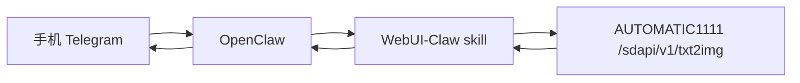

# WebUI-Claw

把 **OpenClaw** 和 **Stable Diffusion WebUI (AUTOMATIC1111 API)** 打通，让用户在手机（Telegram）里直接发中文指令生图，并收到返回图片。

> 典型效果：`生成10张图：赛博朋克猫咪侦探，电影光影，768x1024，steps=30,cfg=7`

---

## 核心能力

- 手机端自然语言生图（中文）
- 自动解析数量/分辨率/步数/CFG
- 通过 WebUI API 批量生成（n_iter）
- 结果回传到 OpenClaw 会话（可逐张发送）

---

## 架构



---

## 目录结构

```bash
WebUI-Claw/
├─ README.md
├─ .env.example
├─ docker-compose.yml
├─ docs/
│  └─ GITHUB_DEPLOY_CN.md
├─ scripts/
│  ├─ deploy.sh
│  └─ healthcheck.sh
└─ skill/
   ├─ SKILL.md
   └─ scripts/
      ├─ generate.py
      └─ parse_and_generate.py
```

---

## 1) 一键部署 WebUI

```bash
git clone https://github.com/YoujunZhao/WebUI-Claw.git
cd WebUI-Claw
cp .env.example .env
bash scripts/deploy.sh
```

部署成功后 API 默认地址：
- `http://127.0.0.1:7860/sdapi/v1/txt2img`

---

## 2) 接入 OpenClaw Skill

```bash
mkdir -p ~/.openclaw/workspace/skills/openclaw-webui-image
cp -r skill/* ~/.openclaw/workspace/skills/openclaw-webui-image/
```

OpenClaw 运行环境变量：

```bash
export SD_WEBUI_URL=http://127.0.0.1:7860
export SD_WEBUI_TIMEOUT=180
```

---

## 3) 手机指令示例

- `生成1张图：赛博朋克夜景，霓虹雨，电影感`
- `生成10张图：国风山水，晨雾，留白感，512x768`
- `生成4张图：机械猫，白底电商图，steps=30,cfg=7`

---

## 4) 在 OpenClaw 里的调用约定（建议）

给你的主助手增加一条规则：

> 当用户出现“生图/画图/生成X张图”等意图时，调用 `openclaw-webui-image` skill，传入用户原始文本；skill 解析参数并调用 WebUI API；结果图片逐张回传会话。

---

## 5) 参数解析规则（内置）

- `生成10张` / `来10张` → `n_iter=10`
- `512x768` / `1024*1024` → `width/height`
- `steps=30` / `步数30` → `steps=30`
- `cfg=7` / `cfg 7` → `cfg_scale=7`
- 未指定时用 `.env` 默认值

---

## 6) 常见问题

### 手机上没收到图
- 检查 OpenClaw 消息通道是否正常
- 检查 skill 输出是否含 `images[]` base64
- 检查平台附件大小限制

### WebUI API 连不上
```bash
docker compose ps
bash scripts/healthcheck.sh
```

### 生成慢
- 降分辨率、降 steps
- 优先 GPU

---

## 7) 安全建议

- 不要直接公网暴露 7860
- 至少加反向代理鉴权
- 记录耗时和失败日志，避免盲排障

---

## 8) License

MIT
