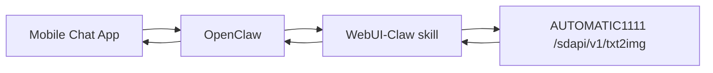

# WebUI-Claw

[](./README.md)
[](./README.zh-CN.md)

OpenClaw + Stable Diffusion WebUI integration for **mobile image generation**.

Users can send natural-language prompts from phone chat apps, and OpenClaw routes requests to WebUI API and returns generated images back in chat.

> Example: `Generate 10 images: cyberpunk cat detective, cinematic lighting, 768x1024, steps=30, cfg=7`

---

## Why this project

- Mobile-first image generation workflow
- Natural-language parameter parsing (count, size, steps, cfg)
- Works across channels supported by OpenClaw
- Easy self-hosted deployment with Docker Compose

---

## Multi-channel support (not Telegram-only)

This project is **channel-agnostic** because OpenClaw handles messaging.

If OpenClaw supports a channel, this flow can work there too (with channel-specific media limits):

- Telegram
- WhatsApp
- Discord
- Slack
- Signal
- Line
- iMessage
- IRC / Google Chat (depending on OpenClaw setup)

So yes — once integrated with OpenClaw, users can use other mobile apps, not only Telegram.

---

## Architecture



---

## Telegram demo screenshots

Real chat screenshots from Telegram flow (generate batch images and return best picks):


---

## Repository structure

```bash
WebUI-Claw/
├─ README.md
├─ README.zh-CN.md
├─ .env.example
├─ docker-compose.yml
├─ docs/
│  └─ GITHUB_DEPLOY_CN.md
├─ scripts/
│  ├─ deploy.sh
│  └─ healthcheck.sh
└─ skill/
   ├─ SKILL.md
   └─ scripts/
      ├─ generate.py
      └─ parse_and_generate.py
```

---

## Quick Start

```bash
git clone https://github.com/YoujunZhao/WebUI-Claw.git
cd WebUI-Claw
cp .env.example .env
bash scripts/deploy.sh
```

Default API endpoint after startup:
- `http://127.0.0.1:7860/sdapi/v1/txt2img`

---

## Connect skill to OpenClaw

```bash
mkdir -p ~/.openclaw/workspace/skills/openclaw-webui-image
cp -r skill/* ~/.openclaw/workspace/skills/openclaw-webui-image/
```

Environment variables for OpenClaw runtime:

```bash
export SD_WEBUI_URL=http://127.0.0.1:7860
export SD_WEBUI_TIMEOUT=180
```

---

## Mobile command examples

- `Generate 1 image: neon cyberpunk city, rainy street, cinematic`
- `Generate 10 images: Chinese ink landscape, morning mist, 512x768`
- `Generate 4 images: robotic cat, product white background, steps=30,cfg=7`

Chinese works as well:
- `生成10张图：赛博朋克猫咪侦探，电影光影，768x1024，steps=30,cfg=7`

---

## Built-in parameter parsing

`parse_and_generate.py` can parse:

- `Generate 10 images` / `生成10张图` → `n_iter=10`
- `512x768` / `1024*1024` → `width/height`
- `steps=30` / `步数30` → `steps=30`
- `cfg=7` / `cfg 7` → `cfg_scale=7`

Defaults come from `.env` if not specified.

---

## FAQ

### Images are not returned to phone
- Check OpenClaw channel configuration
- Check skill output contains `images[]` (base64)
- Check media/file-size limits on your channel

### WebUI API unreachable
```bash
docker compose ps
bash scripts/healthcheck.sh
```

### Slow generation
- Lower resolution or steps
- Use GPU
- Add queue/progress strategy in later versions

---

## Security notes

- Do not expose port 7860 to public Internet directly
- Add reverse proxy + auth for remote access
- Avoid logging sensitive prompts permanently

---

## License

MIT
