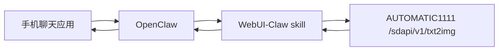

# WebUI-Claw

[](./README.md)
[](./README.zh-CN.md)

OpenClaw + Stable Diffusion WebUI 的移动端生图集成项目。

用户可以在手机聊天软件里发自然语言指令，OpenClaw 会转调 WebUI API 生图，并把图片回传到聊天窗口。

> 示例：`生成10张图：赛博朋克猫咪侦探，电影光影，768x1024，steps=30，cfg=7`

---

## 为什么做这个项目

- 手机优先的生图工作流
- 自然语言参数解析（数量、分辨率、步数、CFG）
- 不局限 Telegram，可复用 OpenClaw 多渠道能力
- Docker Compose 快速自部署

---

## 多渠道支持（不只 Telegram）

这个项目本身是**渠道无关**的，因为消息接入由 OpenClaw 负责。

只要是 OpenClaw 已接入的渠道，理论都能用（注意各平台图片大小限制）：

- Telegram
- WhatsApp
- Discord
- Slack
- Signal
- Line
- iMessage
- IRC / Google Chat（取决于你的 OpenClaw 配置）

所以你说得对：接入 OpenClaw 后，不仅可以 Telegram，也可以其它手机软件。

---

## 架构



---

## Telegram 演示截图

以下为 Telegram 场景下的真实对话演示（批量生图 + 精选回传）：

<p align="center">
  
  
  
</p>

---

## 目录结构

```bash
WebUI-Claw/
├─ README.md
├─ README.zh-CN.md
├─ .env.example
├─ docker-compose.yml
├─ docs/
│  └─ GITHUB_DEPLOY_CN.md
├─ scripts/
│  ├─ deploy.sh
│  └─ healthcheck.sh
└─ skill/
   ├─ SKILL.md
   └─ scripts/
      ├─ generate.py
      └─ parse_and_generate.py
```

---

## 快速开始

```bash
git clone https://github.com/YoujunZhao/WebUI-Claw.git
cd WebUI-Claw
cp .env.example .env
bash scripts/deploy.sh
```

启动后默认 API：
- `http://127.0.0.1:7860/sdapi/v1/txt2img`

---

## 接入 OpenClaw Skill

```bash
mkdir -p ~/.openclaw/workspace/skills/openclaw-webui-image
cp -r skill/* ~/.openclaw/workspace/skills/openclaw-webui-image/
```

OpenClaw 运行环境变量：

```bash
export SD_WEBUI_URL=http://127.0.0.1:7860
export SD_WEBUI_TIMEOUT=180
```

---

## 手机指令示例

- `生成1张图：霓虹赛博城市，雨夜街道，电影感`
- `生成10张图：国风山水，晨雾，留白感，512x768`
- `生成4张图：机械猫，白底电商图，steps=30,cfg=7`

英文同样支持：
- `Generate 10 images: cyberpunk cat detective, cinematic light, 768x1024, steps=30, cfg=7`

---

## 内置参数解析

`parse_and_generate.py` 默认可解析：

- `生成10张图` / `Generate 10 images` → `n_iter=10`
- `512x768` / `1024*1024` → `width/height`
- `steps=30` / `步数30` → `steps=30`
- `cfg=7` / `cfg 7` → `cfg_scale=7`

未指定参数时会使用 `.env` 默认值。

---

## 常见问题

### 手机上收不到图
- 检查 OpenClaw 渠道配置
- 检查 skill 输出是否包含 `images[]` base64
- 检查目标渠道的媒体大小限制

### WebUI API 连不上
```bash
docker compose ps
bash scripts/healthcheck.sh
```

### 生成慢
- 降低分辨率/步数
- 使用 GPU
- 后续可加队列与进度反馈

---

## 安全建议

- 不要直接将 7860 暴露公网
- 远程访问请加反向代理 + 鉴权
- 避免永久记录敏感提示词

---

## License

MIT
