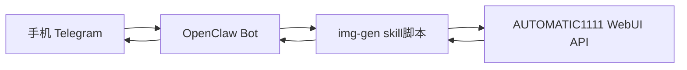

# OpenClaw + WebUI Mobile Image Bot

一个把 **OpenClaw** 和 **Stable Diffusion WebUI (AUTOMATIC1111 API)** 结合的示例项目。

目标：
- 用户在手机（Telegram）给 OpenClaw 发指令
- OpenClaw 调用 WebUI API 生成图片
- 生成结果直接回传到手机聊天窗口

> 适合做“手机远程生图助手”，体验类似：`生成10张图，主题xxx`。

---

## 1. 架构



- **OpenClaw**：负责消息接入与多轮对话
- **img-gen skill**：把自然语言参数转换为 WebUI API payload
- **WebUI API**：负责真正生图（txt2img / img2img）

---

## 2. 功能清单

- [x] 文生图（txt2img）
- [x] 一次生成多张（batch）
- [x] 支持宽高、步数、CFG、采样器、种子
- [x] 手机端直接收图
- [x] 环境变量配置（无需改代码）

---

## 3. 目录结构

```bash
openclaw-webui-mobile-image/
├─ README.md
├─ .env.example
├─ docker-compose.yml
├─ scripts/
│  ├─ deploy.sh
│  └─ healthcheck.sh
└─ skill/
   ├─ SKILL.md
   └─ scripts/
      └─ generate.py
```

---

## 4. 前置条件

1. 你已可用 OpenClaw（本机或服务器）
2. 你有 Telegram 接入（或其它消息渠道）
3. 机器具备 GPU（推荐）和 Docker

---

## 5. 一键部署（WebUI）

```bash
git clone https://github.com/<your-org>/openclaw-webui-mobile-image.git
cd openclaw-webui-mobile-image
cp .env.example .env
bash scripts/deploy.sh
```

部署完成后，默认 API 地址：
- `http://127.0.0.1:7860/sdapi/v1/txt2img`

---

## 6. 将 skill 接到 OpenClaw

把本仓库 `skill/` 目录拷贝到你的 OpenClaw skills 目录（示例）：

```bash
mkdir -p ~/.openclaw/workspace/skills/openclaw-webui-image
cp -r skill/* ~/.openclaw/workspace/skills/openclaw-webui-image/
```

在 OpenClaw 中让模型调用该 skill（按你现有技能加载方式）。

环境变量（OpenClaw 运行环境）：

```bash
export SD_WEBUI_URL=http://127.0.0.1:7860
export SD_WEBUI_TIMEOUT=180
```

---

## 7. 手机侧使用示例

你在 Telegram 里对 OpenClaw 说：

- `生成1张图：赛博朋克夜景，霓虹雨，电影感，4k`
- `生成10张图：国风山水，晨雾，留白感，512x768`
- `生成4张图：机械猫，白底电商图，steps=30,cfg=7`

建议给 OpenClaw 一段系统约定（示例）：

> 当用户提到“生成X张图/生图/画图”，调用 `openclaw-webui-image` skill。把自然语言参数解析为 txt2img 参数，生成后逐张发送回聊天窗口。

---

## 8. API 参数映射建议

自然语言 → WebUI:

- “生成10张” → `batch_size=1`, `n_iter=10`
- “512x768” → `width=512`, `height=768`
- “步数30” → `steps=30`
- “cfg 7” → `cfg_scale=7`
- 未指定种子 → `seed=-1`

---

## 9. 常见问题

### Q1: 手机上收不到图
- 检查 OpenClaw 消息通道配置
- 检查 skill 是否真的执行并返回 base64 图片
- 检查消息平台附件大小限制

### Q2: 生成很慢
- 降低分辨率或步数
- 优先使用 GPU
- 并发场景下加任务队列（后续可接 Redis）

### Q3: WebUI API 连不上
- `docker compose ps`
- `bash scripts/healthcheck.sh`
- 检查 `SD_WEBUI_URL`

---

## 10. 生产建议

- 使用反向代理并加鉴权
- 仅内网暴露 7860
- OpenClaw 与 WebUI 放同一内网
- 记录请求日志（提示词/参数/耗时）

---

## 11. Roadmap

- [ ] 支持 img2img
- [ ] 支持 ControlNet
- [ ] 支持 LoRA 快捷词
- [ ] 支持“任务完成后打包10图zip发送”
- [ ] 支持队列与进度通知

---

## 12. License

MIT
